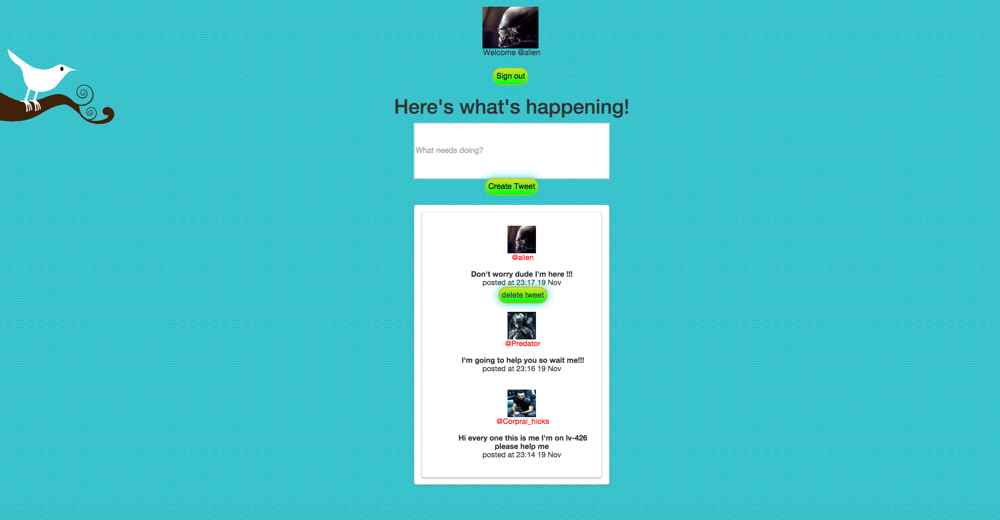

Twitter-Gram
================================

## Description

The program based on instagram-challenge, where you can chat and add photos, after authentication.  

## Production Team

 [Moe Sadoon](https://github.com/MoeSadoon)
 
 [Evgenii Leshchenko](https://github.com/TJQKAs)
 
 [Catherine Stevenson](https://github.com/catherinestevenson)
 
 [Sarah Kristine Pedersen](https://github.com/sarahkristinepedersen)

## Getting started

Web version - https://calm-garden-3564.herokuapp.com/

## Technologies Used

- ruby
- ruby on rails
- DataMapper
- Bootstrap
